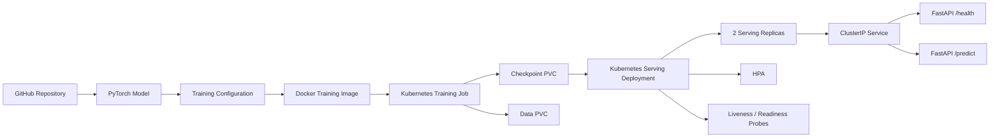

# MLOps PyTorch Pipeline

MLOps Assignment 3 for deploying a PyTorch CIFAR-10 image classification model using Docker and Kubernetes.

## Project Overview

This project demonstrates an end-to-end model deployment workflow:

**Git/GitHub → PyTorch → Docker → Kubernetes → FastAPI inference**

The model uses a ResNet-18 based classifier trained on CIFAR-10. Training configuration is provided through YAML/ConfigMap, the trained checkpoint is stored on a Kubernetes PersistentVolumeClaim, and the FastAPI service exposes health and prediction endpoints.

## System Architecture



## Main Components

- **PyTorch** – model, dataset, training and inference code
- **Docker** – reproducible training and serving environments
- **Kubernetes Job** – runs model training
- **PersistentVolumeClaims** – store CIFAR-10 data and model checkpoints
- **ConfigMap** – provides the training configuration
- **Deployment** – runs two model-serving replicas
- **ClusterIP Service** – exposes the serving application inside Kubernetes
- **HPA** – configured for CPU-based horizontal scaling
- **FastAPI** – provides `/health` and `/predict`

## Repository Structure

```text
mlops-pytorch-pipeline/
├── configs/
│   └── training_config.yaml
├── docker/
│   ├── Dockerfile.train
│   └── Dockerfile.serve
├── k8s/
│   ├── namespace.yaml
│   ├── configmap.yaml
│   ├── training-job.yaml
│   ├── serving-deployment.yaml
│   ├── serving-service.yaml
│   └── hpa.yaml
├── requirements/
│   ├── train.txt
│   └── serve.txt
├── src/
│   ├── dataset.py
│   ├── model.py
│   ├── train.py
│   └── serve.py
├── tests/
├── .gitignore
├── .dockerignore
└── README.md
```

## Prerequisites

- Python 3.10+
- Docker Desktop
- Kubernetes enabled in Docker Desktop
- `kubectl`
- Git

Verify the tools:

```powershell
python --version
docker --version
kubectl version --client
git --version
```

## Local Python Setup

Create and activate a virtual environment:

```powershell
python -m venv .venv
.venv\Scripts\Activate.ps1
```

Install training dependencies:

```powershell
pip install -r requirements/train.txt
```

## Docker Training

Build the training image:

```powershell
docker build -f docker/Dockerfile.train -t mlops-cifar-train:v1 .
```

## Docker Serving

Build the serving image:

```powershell
docker build -f docker/Dockerfile.serve -t mlops-cifar-serve:v1 .
```

Run the serving container:

```powershell
docker run -d --name mlops-cifar-serve -p 8080:8080 mlops-cifar-serve:v1
```

Check the container:

```powershell
docker ps
```

Test the health endpoint:

```powershell
Invoke-RestMethod http://localhost:8080/health
```

Stop the container when finished:

```powershell
docker stop mlops-cifar-serve
docker rm mlops-cifar-serve
```

## Kubernetes Deployment

The Kubernetes resources are deployed in the `ml-training` namespace.

Create the namespace:

```powershell
kubectl apply -f k8s/namespace.yaml
```

Apply the training configuration:

```powershell
kubectl apply -f k8s/configmap.yaml
```

Create the training Job and persistent volumes:

```powershell
kubectl apply -f k8s/training-job.yaml
```

Check the training workload:

```powershell
kubectl get pods,job,pvc -n ml-training
```

Deploy model serving:

```powershell
kubectl apply -f k8s/serving-deployment.yaml
kubectl apply -f k8s/serving-service.yaml
kubectl apply -f k8s/hpa.yaml
```

Check the complete deployment:

```powershell
kubectl get pods,job,deploy,svc,hpa,pvc -n ml-training
```

The serving Deployment is configured with two replicas and the HPA can scale the deployment from two to four replicas based on CPU utilization.

## API Validation

Forward the Kubernetes Service to the local machine:

```powershell
kubectl port-forward svc/model-serving 8000:80 -n ml-training
```

In another PowerShell window, test the health endpoint:

```powershell
Invoke-WebRequest http://localhost:8000/health -UseBasicParsing |
    Select-Object -ExpandProperty Content
```

Example response:

```json
{
  "status": "ok",
  "device": "cpu",
  "model_loaded": true
}
```

Test prediction using an image:

```powershell
curl.exe -X POST "http://localhost:8000/predict" -F "file=@test.jpg"
```

Example response:

```json
{
  "class_id": 2,
  "confidence": 0.3574
}
```

## Kubernetes Validation

Useful commands:

```powershell
kubectl get pods -n ml-training
kubectl get job -n ml-training
kubectl get deployment -n ml-training
kubectl get svc -n ml-training
kubectl get hpa -n ml-training
kubectl get pvc -n ml-training
```

The final validation demonstrated:

- two ready model-serving replicas
- Kubernetes Service available
- persistent storage for training data and checkpoints
- `/health` returning `model_loaded=true`
- `/predict` returning a successful prediction
- HPA configured for CPU-based scaling
- liveness and readiness probes configured for the serving deployment

## Git Workflow

Development follows a feature-branch and Pull Request workflow.

```text
main
 ├── feature/model-fastapi
 ├── feature/docker-training
 └── feature/k8s-deployment
```

Feature branches are merged through Pull Requests into `main`.

The repository contains multiple merged Pull Requests covering the implementation stages.

## API Endpoints

### GET `/health`

Returns the service health, device information and whether the model checkpoint was loaded.

### POST `/predict`

Accepts an image file and returns the predicted CIFAR-10 class ID and confidence.

## Technologies

- Python
- PyTorch
- torchvision
- FastAPI
- Uvicorn
- Docker
- Kubernetes
- kubectl
- Git / GitHub

## Assignment Validation

The final implementation was validated through terminal commands and screenshots covering Docker/Kubernetes deployment, persistent storage, serving replicas, health checks and successful prediction.

## GitHub Repository

[https://github.com/da25m569/mlops-pytorch-pipeline](https://github.com/da25m569/mlops-pytorch-pipeline)
